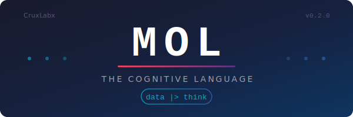
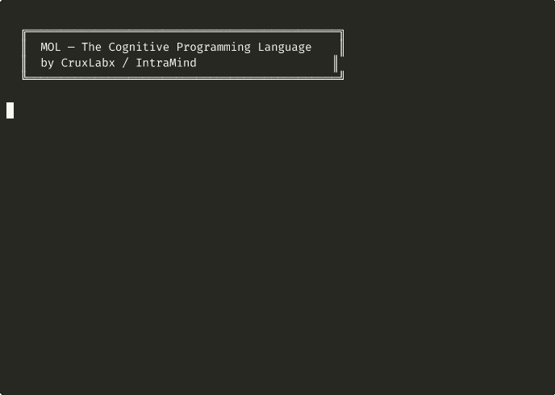

<p align="center">
  
</p>

<h1 align="center">MOL — The IntraMind Programming Language</h1>

<p align="center">
  
  
  
  
  
  
  
  
  
  
  
</p>

<p align="center">
  <strong>The first programming language with native pipeline operators and auto-tracing — built for AI/RAG pipelines.</strong>
</p>

<p align="center">
  
</p>

---

## Why MOL Exists

Every AI pipeline today is glue code — Python scripts stitching together LangChain, LlamaIndex, vector DBs, and LLMs with no visibility into what happens between steps. MOL fixes this.

| Problem | How Python/JS Handle It | How MOL Handles It |
|---|---|---|
| **Pipeline Debugging** | Add `print()` everywhere, use logging libs | **Auto-tracing built into `\|>`** — every step timed & typed automatically |
| **Data Flow Visibility** | No native pipe operator | **`\|>` operator** — data flows left-to-right, traced at every stage |
| **Type Safety for AI** | Generic dicts, no domain types | **First-class types:** `Thought`, `Memory`, `Node`, `Document`, `Chunk`, `Embedding` |
| **RAG Boilerplate** | 50+ lines of setup code | **One expression:** `doc \|> chunk(512) \|> embed \|> store("index")` |
| **Safety Rails** | Hope for the best | **`guard` assertions + `access` control** at the language level |
| **Portability** | Rewrite in each language | **Transpiles to Python and JavaScript** from single `.mol` source |

### The Killer Feature: `|>` with Auto-Tracing

No other language has this combination:

| Language | Pipe Operator | Auto-Tracing | AI Domain Types | RAG Built-in |
|---|---|---|---|---|
| Python | No | No | No | No |
| Elixir | `\|>` | No | No | No |
| F# | `\|>` | No | No | No |
| Rust | No | No | No | No |
| **MOL** | **`\|>`** | **Yes** | **Yes** | **Yes** |

---

## Installation

Choose the method that works best for you:

### 1. Install from PyPI (Recommended)

```bash
pip install mol-lang
```

Then use anywhere:
```bash
mol run hello.mol
mol repl
mol version
```

### 2. Docker

```bash
# Run a program
docker run --rm -v "$(pwd)":/app ghcr.io/crux-ecosystem/mol run /app/hello.mol

# Interactive REPL
docker run --rm -it ghcr.io/crux-ecosystem/mol repl

# Start the online playground
docker run --rm -p 8000:8000 ghcr.io/crux-ecosystem/mol playground
```

Image size: ~144 MB (Python 3.12-slim based)

### 3. From Source

```bash
git clone https://github.com/crux-ecosystem/mol-lang.git
cd mol-lang
python3 -m venv .venv
source .venv/bin/activate
pip install -e .
```

### 4. With LSP Support (for VS Code)

```bash
pip install mol-lang[lsp]
```

Then install the VS Code extension from `mol-vscode/` or copy it:
```bash
cp -r mol-vscode/ ~/.vscode/extensions/mol-language-0.5.0
```

### 5. Online Playground (No Install)

Try MOL directly in your browser: **[https://mol.cruxlabx.in](https://mol.cruxlabx.in)**

> **🔒 Sandbox Mode**: The playground runs in a secure sandbox. File I/O, network requests, server binding, and concurrency primitives are disabled. Install MOL locally for full access to all 143 stdlib functions.

---

## Security

The MOL playground implements multiple layers of security:

| Protection | Details |
|---|---|
| **Sandbox Mode** | 26 dangerous functions blocked (file I/O, network, server, concurrency) |
| **Execution Timeout** | Code killed after 5 seconds to prevent infinite loops |
| **Rate Limiting** | 30 requests/minute per IP address |
| **Code Size Limit** | Maximum 10KB input code |
| **Output Truncation** | Output capped at 50K characters |
| **Recursion Limit** | Python recursion depth enforced |
| **Loop Detection** | Built-in infinite loop detector (1M iterations) |
| **CORS Restricted** | Only authorized origins allowed |

Check the security policy at: `GET /api/security`

To report security issues: [open a GitHub issue](https://github.com/crux-ecosystem/mol-lang/issues) or contact `kaliyugiheart@gmail.com`.

---

## Quick Start

### Hello World

```mol
show "Hello from MOL!"
```

```bash
mol run hello.mol
```

### Your First Pipeline

```mol
-- A full RAG ingestion pipeline in ONE expression
let doc be Document("notes.txt", "MOL is built for IntraMind pipelines.")

let index be doc |> chunk(30) |> embed |> store("my_index")

show index
```

**Output:**
```
  ┌─ Pipeline Trace ──────────────────────────────────────
  │ 0.  input                   ─  <Document:a3f2 "notes.txt" 39B>
  │ 1.  chunk(..)           0.1ms  → List<2 Chunks>
  │ 2.  embed               0.2ms  → List<2 Embeddings>
  │ 3.  store(..)           0.0ms  → <VectorStore:b7c1 "my_index" 2 vectors>
  └─ 3 steps · 0.3ms total ───────────────────────────
<VectorStore:b7c1 "my_index" 2 vectors>
```

Zero configuration. Every step timed, typed, and traced automatically.

---

## Language Overview

### Variables & Types

```mol
-- Inferred type
let name be "IntraMind"
let count be 42

-- Explicit type annotation (mismatch = compile error)
let x : Number be 10
let msg : Text be "hello"
let flag : Bool be true

-- Reassignment
set count to count + 1
```

### Control Flow

```mol
if score > 90 then
  show "excellent"
elif score > 70 then
  show "good"
else
  show "needs work"
end

while count < 10 do
  set count to count + 1
end

for item in range(5) do
  show to_text(item)
end
```

### Functions

```mol
define greet(name)
  return "Hello, " + name + "!"
end

show greet("Mounesh")
```

### Comments

```mol
-- This is a comment
show "code"  -- inline comment
```

---

## Pipeline Operator `|>`

The core of MOL. Data flows left → right through functions:

```mol
-- Single stage
"hello world" |> upper              -- "HELLO WORLD"

-- With arguments
"a,b,c" |> split(",")              -- ["a", "b", "c"]

-- Multi-stage chain (auto-traced when 3+ stages)
"  HELLO  " |> trim |> lower |> split(" ")

-- With custom functions
define double(x)
  return x * 2
end

5 |> double |> add_ten |> double    -- 40
```

### Pipeline Definitions

Named, reusable pipelines:

```mol
pipeline preprocess(data)
  return data |> trim |> lower
end

let clean be "  RAW INPUT  " |> preprocess
show clean   -- "raw input"
```

### Auto-Tracing

Any pipe chain with 3+ stages automatically prints a trace:

```
  ┌─ Pipeline Trace ──────────────────────────────────────
  │ 0.  input                   ─  Text("  HELLO  ")
  │ 1.  trim                0.0ms  → Text("HELLO")
  │ 2.  lower               0.0ms  → Text("hello")
  │ 3.  split(..)           0.0ms  → List<1 strs>
  └─ 3 steps · 0.0ms total ───────────────────────────
```

Disable tracing with `--no-trace`:

```bash
mol run program.mol --no-trace
```

---

## Domain Types

### Core Types (v0.1.0)

| Type | Purpose | Constructor |
|---|---|---|
| `Thought` | Cognitive unit with confidence score | `Thought("idea", 0.9)` |
| `Memory` | Persistent key-value with decay | `Memory("key", value)` |
| `Node` | Neural graph vertex with weight | `Node("label", 0.5)` |
| `Stream` | Real-time data buffer | `Stream("feed")` |

### RAG Types (v0.2.0)

| Type | Purpose | Constructor |
|---|---|---|
| `Document` | Text document with source metadata | `Document("file.txt", "content...")` |
| `Chunk` | Text fragment from a document | `Chunk("text", 0, "source")` |
| `Embedding` | Vector embedding (64-dim, deterministic) | `Embedding("text", "model")` |
| `VectorStore` | In-memory vector index with similarity search | Created via `store()` |

### Domain Commands

```mol
trigger "event_name"           -- Fire an event
listen "event_name" do ... end -- Listen for events
link nodeA to nodeB            -- Connect nodes
process node with 0.3          -- Activate & adjust
evolve node                    -- Next generation
access "mind_core"             -- Request resource (checked!)
sync stream                    -- Synchronize data
emit "data"                    -- Emit to stream
```

---

## Guard Assertions

Inline safety checks that halt execution on failure:

```mol
guard confidence > 0.8 : "Confidence too low for production"
guard len(data) > 0 : "Empty dataset"
guard answer |> assert_not_null
```

---

## RAG Pipeline (Full Example)

```mol
-- 1. Create a document
let doc be Document("kb.txt", "Machine learning enables computers to learn. Deep learning uses neural networks.")

-- 2. Ingest: chunk → embed → store (ONE expression)
doc |> chunk(50) |> embed |> store("knowledge")

-- 3. Query
let results be retrieve("What is deep learning?", "knowledge", 3)

-- 4. Synthesize answer
let answer be results |> think("answer the question")

-- 5. Validate quality
guard answer.confidence > 0.5 : "Low confidence"

show answer.content
```

---

## Safety Rails

### Access Control

```mol
access "mind_core"      -- ✅ Allowed
access "memory_bank"    -- ✅ Allowed
access "secret_vault"   -- 🔒 DENIED — MOLSecurityError
```

Default allowed: `mind_core`, `memory_bank`, `node_graph`, `data_stream`, `thought_pool`.

### Type Enforcement

```mol
let x : Number be "hello"   -- 🚫 MOLTypeError at declaration
```

---

## Standard Library (90+ functions)

| Category | Functions |
|---|---|
| **General** | `len`, `type_of`, `to_text`, `to_number`, `range`, `abs`, `round`, `sqrt`, `max`, `min`, `sum`, `print` |
| **Functional** | `map`, `filter`, `reduce`, `flatten`, `unique`, `zip`, `enumerate`, `count`, `find`, `find_index`, `take`, `drop`, `group_by`, `chunk_list`, `every`, `some` |
| **Math** | `floor`, `ceil`, `log`, `sin`, `cos`, `tan`, `pi`, `e`, `pow`, `clamp`, `lerp` |
| **Statistics** | `mean`, `median`, `stdev`, `variance`, `percentile` |
| **Collections** | `sort`, `sort_by`, `sort_desc`, `binary_search`, `reverse`, `push`, `pop`, `keys`, `values`, `contains`, `join`, `slice` |
| **Strings** | `split`, `upper`, `lower`, `trim`, `replace`, `starts_with`, `ends_with`, `pad_left`, `pad_right`, `repeat`, `char_at`, `index_of`, `format` |
| **Hashing & Encoding** | `hash`, `uuid`, `base64_encode`, `base64_decode` |
| **Random** | `random`, `random_int`, `shuffle`, `sample`, `choice` |
| **Map Utilities** | `merge`, `pick`, `omit` |
| **Type Checks** | `is_null`, `is_number`, `is_text`, `is_list`, `is_map` |
| **Serialization** | `to_json`, `from_json`, `inspect` |
| **Time** | `clock`, `wait` |
| **RAG Pipeline** | `load_text`, `chunk`, `embed`, `store`, `retrieve`, `cosine_sim` |
| **Cognitive** | `think`, `recall`, `classify`, `summarize` |
| **Debug** | `display`, `tap`, `assert_min`, `assert_not_null` |

---

## CLI

```bash
# Core
mol run <file.mol>                    # Run a program
mol run <file.mol> --no-trace         # Run without pipeline tracing
mol parse <file.mol>                  # Show AST tree
mol transpile <file.mol>              # Transpile to Python
mol transpile <file.mol> -t js        # Transpile to JavaScript
mol repl                              # Interactive REPL
mol version                           # Show version

# Package Manager (v0.5.0)
mol init                              # Initialize mol.json manifest
mol install <package>                 # Install a package
mol uninstall <package>               # Remove a package
mol list                              # List installed packages
mol search <query>                    # Search available packages
mol publish                           # Publish your package

# Browser/JS Compilation (v0.5.0)
mol build <file.mol>                  # Compile to standalone HTML (browser)
mol build <file.mol> --target js      # Compile to JavaScript
mol build <file.mol> --target node    # Compile to Node.js module
mol build <file.mol> -o output.html   # Custom output path

# LSP Server
mol lsp                               # Start language server (for editors)
```

---

## Transpilation

```bash
mol transpile pipeline.mol --target python > output.py
mol transpile pipeline.mol --target js > output.js
```

Pipe chains are desugared into nested function calls:

```mol
-- MOL
"hello" |> upper |> split(" ")
```
```python
# Python output
split(upper("hello"), " ")
```
```javascript
// JavaScript output
split(upper("hello"), " ")
```

---

## VS Code Extension & LSP

Full IDE support included in `mol-vscode/`:

- **LSP Server** — Autocomplete (112 stdlib + keywords), hover docs, diagnostics, signature help, go-to-definition, document symbols
- **Syntax Highlighting** — TextMate grammar
- **Auto-closing** — Brackets and quotes
- **Code Folding** — `if...end`, `define...end`, `pipeline...end`
- **20+ Snippets** — Quick templates

### Install

```bash
pip install mol-lang[lsp]
cp -r mol-vscode/ ~/.vscode/extensions/mol-language-0.5.0
# Restart VS Code
```

---

## Packages & `use` Statement (v0.5.0)

MOL ships with 7 built-in packages:

| Package | Functions |
|---|---|
| `std` | `len`, `type_of`, `range`, `map`, `filter`, `reduce`, `sort`, ... |
| `math` | `sqrt`, `pow`, `sin`, `cos`, `pi`, `e`, `floor`, `ceil`, ... |
| `text` | `split`, `upper`, `lower`, `trim`, `replace`, `join`, ... |
| `collections` | `flatten`, `unique`, `zip`, `group_by`, `sort_by`, ... |
| `crypto` | `hash`, `uuid`, `base64_encode`, `base64_decode` |
| `random` | `random`, `random_int`, `shuffle`, `sample`, `choice` |
| `rag` | `chunk`, `embed`, `store`, `retrieve`, `cosine_sim`, `think` |

```mol
-- Import everything
use std

-- Import specific functions
use math : sqrt, pi

-- Alias
use text as T
```

---

## Concurrency (v0.7.0)

### Spawn & Await

```mol
let task be spawn do
  sleep(1000)
  "result"
end
show "main continues..."
let result be await task
```

### Parallel Map

```mol
let results be parallel(items, fn(x) -> process(x))
```

### Channels

```mol
let ch be channel()
spawn do
  send(ch, "hello")
end
let msg be receive(ch)
```

### Race & Wait All

```mol
let winner be race([task1, task2])    -- first to finish
let all be wait_all([task1, task2])   -- wait for all
```

---

## Power Features (v0.6.0)

### Lambda Expressions

```mol
let double be fn(x) -> x * 2
let result be [1, 2, 3] |> map(fn(x) -> x * x)
```

### Pattern Matching

```mol
let grade be match score with
  | s when s >= 90 -> "A"
  | s when s >= 80 -> "B"
  | [x, y] -> f"pair({x}, {y})"
  | _ -> "default"
end
```

### Null Safety

```mol
let timeout be config ?? 30         -- fallback if null
```

### String Interpolation

```mol
let msg be f"Hello {name}, you have {count} items"
```

### Destructuring

```mol
let [first, ...rest] be [1, 2, 3, 4]
let {x, y} be {"x": 10, "y": 20}
```

### Error Handling

```mol
try
  let data be risky_operation()
rescue e
  show f"Error: {e}"
ensure
  cleanup()
end
```

### Default Parameters

```mol
define greet(name, greeting be "Hello")
  show f"{greeting}, {name}!"
end
greet("World")          -- Hello, World!
greet("MOL", "Welcome") -- Welcome, MOL!
```

### Built-in Testing

```mol
test "arithmetic" do
  assert_eq(2 + 2, 4)
  assert_true(10 > 5)
end
```

Run tests with: `mol test` (discovers all `.mol` files) or `mol test myfile.mol`.

---

## Browser/JS Compilation (v0.5.0)

Compile MOL programs to standalone HTML or JavaScript:

```bash
mol build app.mol                  # → app.html (runs in browser)
mol build app.mol --target js      # → app.js (standalone JS)
mol build app.mol --target node    # → app.node.js (Node.js module)
```

Compiled output includes the complete MOL runtime (90+ stdlib functions ported to JavaScript). No dependencies required.

---

## Project Structure

```
MOL/
├── mol/                        # Language implementation
│   ├── __init__.py             # Package metadata (v0.5.0)
│   ├── grammar.lark            # Lark EBNF grammar specification
│   ├── parser.py               # LALR parser + AST transformer
│   ├── ast_nodes.py            # 45+ AST node dataclasses
│   ├── interpreter.py          # Visitor-pattern interpreter with auto-tracing
│   ├── types.py                # Domain types (8 types)
│   ├── stdlib.py               # 90+ built-in functions
│   ├── transpiler.py           # Python & JavaScript transpiler
│   ├── lsp_server.py           # Language Server Protocol (LSP) server
│   ├── package_manager.py      # Package manager (init/install/publish)
│   ├── wasm_builder.py         # Browser/JS compilation
│   ├── runtime.js              # JavaScript runtime (90+ functions)
│   └── cli.py                  # CLI interface
├── docs/                       # MkDocs Material documentation source
├── examples/                   # 16 example programs
├── tutorial/                   # 6 tutorial files + cheatsheet
├── tests/test_mol.py           # 68 tests (all passing)
├── mol-vscode/                 # VS Code extension + LSP client
├── mkdocs.yml                  # MkDocs configuration
├── pyproject.toml              # Python project config
├── Dockerfile                  # Docker image (144 MB)
├── LANGUAGE_SPEC.md            # Formal language specification
├── CHANGELOG.md                # Version history
├── ROADMAP.md                  # Development roadmap
└── LICENSE                     # License
```

---

## Architecture

```
┌─────────────┐     ┌──────────────┐     ┌─────────────┐     ┌──────────────┐
│  .mol file  │ ──▶ │  Lark LALR   │ ──▶ │     AST     │ ──▶ │ Interpreter  │
│  (source)   │     │  Parser      │     │  (35+ node  │     │  (Visitor +  │
│             │     │              │     │   types)    │     │  Auto-Trace) │
└─────────────┘     └──────────────┘     └──────┬──────┘     └──────────────┘
                                                │
                                    ┌───────────┼───────────┐
                                    ▼           ▼           ▼
                              ┌──────────┐ ┌──────────┐ ┌──────────┐
                              │  Python  │ │   JS     │ │  (more)  │
                              │  Output  │ │  Output  │ │          │
                              └──────────┘ └──────────┘ └──────────┘
```

---

## Testing

```bash
source .venv/bin/activate
python tests/test_mol.py
```

147 tests covering: variables, arithmetic, control flow, functions, recursion, lists, maps, strings, domain types, typed declarations, access control, events, pipes, guards, pipelines, chunking, embedding, vector search, full RAG integration, functional programming (map/filter/reduce), math functions, statistics, string algorithms, hashing, sorting, type checks, lambdas, pattern matching, null coalescing, string interpolation, destructuring, error handling, default parameters, built-in testing, spawn/await, channels, parallel map, race, concurrency patterns, field/index mutation, zero-arg lambdas, try/rescue with return, JSON functions, struct methods, and module system.

---

## Version History

| Version | Highlights |
|---|---|
| **v1.0.0** (current) | **First stable release**: 143 stdlib functions, structs, pattern matching, generators, concurrency, modules, WASM, LSP, sandboxed playground, 181 tests, community infrastructure |
| **v0.10.0** | **Security hardening**: sandboxed playground, 26 dangerous functions blocked, execution timeout, rate limiting, code size limits, CORS restrictions, `/api/security` endpoint, 181 tests |
| **v0.9.0** | Self-hosted codebase, web API server, IntraMind AI core, field/index mutation, `serve()`, `json_parse/stringify`, 147 tests |
| **v0.8.0** | Structs with methods, generators/iterators, file I/O, HTTP fetch, modules (`use`/`export`), 123 tests |
| **v0.7.0** | `spawn`/`await`, channels, `parallel()`, `race()`, `wait_all()`, `sleep()`, 102 tests |
| **v0.6.0** | Pattern matching, lambdas, `??` null safety, `f""` interpolation, destructuring, `try/rescue/ensure`, default params, `mol test` |
| **v0.5.0** | Package manager, `use` statement, browser/JS compilation, JS runtime |
| **v0.4.0** | Docker support (144MB), LSP server, VS Code extension, 16 examples |
| **v0.3.0** | 90+ stdlib functions, MkDocs docs, online playground |
| **v0.2.0** | RAG types (`Document`, `Chunk`, `Embedding`, `VectorStore`), full RAG pipeline |
| **v0.1.0** | Core language: pipes `|>` with auto-tracing, domain types, transpiler |

See [CHANGELOG.md](CHANGELOG.md) for full details.

## Roadmap

See [ROADMAP.md](ROADMAP.md) for the full plan.

### Documentation

Full documentation available at: **[https://crux-ecosystem.github.io/mol-lang/](https://crux-ecosystem.github.io/mol-lang/)**

---

## Community

- **GitHub Discussions**: [Ask questions, share ideas](https://github.com/crux-ecosystem/mol-lang/discussions)
- **Issue Tracker**: [Report bugs, request features](https://github.com/crux-ecosystem/mol-lang/issues)
- **Contributing**: See [CONTRIBUTING.md](CONTRIBUTING.md) for guidelines
- **Code of Conduct**: See [CODE_OF_CONDUCT.md](CODE_OF_CONDUCT.md)
- **Security**: See [SECURITY.md](SECURITY.md) for vulnerability reporting

---

## Authors

Built for **IntraMind** by **CruxLabx**.

**Creator:** Mounesh Kodi

## License

Proprietary — CruxLabx / IntraMind. All rights reserved.
