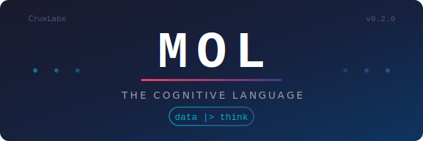

<p align="center">
  
</p>

<h1 align="center">MOL — The Cognitive Programming Language</h1>

<p align="center">
  <strong>Built for AI pipelines. Born from <a href="https://github.com/crux-ecosystem">IntraMind</a>.</strong>
</p>

<p align="center">
  
  
  
  
  
  
  
  
</p>

<p align="center">
  <a href="#the-problem">Problem</a> •
  <a href="#the-solution">Solution</a> •
  <a href="#see-it-in-action">Demo</a> •
  <a href="#language-at-a-glance">Language</a> •
  <a href="#try-it-online">Playground</a> •
  <a href="#try-it-online">Playground</a> •
  <a href="https://medium.com/@cruxlabx/introducing-mol">Blog Post</a>
</p>

---

## The Problem

Every AI pipeline today looks like this:

```python
# Python: 47 lines of glue code, zero visibility
from langchain.text_splitter import RecursiveCharacterTextSplitter
from langchain.embeddings import OpenAIEmbeddings
from langchain.vectorstores import FAISS
import logging

logging.basicConfig(level=logging.DEBUG)  # hope this helps

doc = load_document("knowledge.txt")
splitter = RecursiveCharacterTextSplitter(chunk_size=512)
chunks = splitter.split_documents([doc])
# print(f"DEBUG: {len(chunks)} chunks")  # <-- you'll add 20 of these
embeddings = OpenAIEmbeddings()
vectors = FAISS.from_documents(chunks, embeddings)
results = vectors.similarity_search(query, k=3)
# What happened between steps? Who knows.
```

**No visibility. No tracing. No domain types. Just glue.**

---

## The Solution

The same pipeline in MOL:

```
let index be doc |> chunk(512) |> embed("model-v1") |> store("kb")
let answer be retrieve(query, "kb", 3) |> think("answer this")
guard answer.confidence > 0.5 : "Low confidence"
```

**3 lines. Auto-traced. Type-safe. Done.**

When you run it, MOL automatically shows you what happened:

```
  ┌─ Pipeline Trace ──────────────────────────────────────
  │ 0.  input                   ─  <Document "knowledge.txt" 339B>
  │ 1.  chunk(512)          0.1ms  → List<5 Chunks>
  │ 2.  embed("model-v1")   0.2ms  → List<5 Embeddings>
  │ 3.  store("kb")         0.0ms  → <VectorStore "kb" 5 vectors>
  └─ 3 steps · 0.4ms total ───────────────────────────
```

**No print statements. No logging setup. Auto-tracing is built into the language.**

---

## What Makes MOL Different

| Feature | Python | Elixir | F# | **MOL** |
|:---|:---:|:---:|:---:|:---:|
| Pipe operator `\|>` | — | ✓ | ✓ | **✓** |
| **Auto-tracing on pipes** | — | — | — | **✓** |
| AI domain types | — | — | — | **✓** |
| RAG primitives built-in | — | — | — | **✓** |
| Guard assertions | — | ✓ | — | **✓** |
| Transpiles to Python & JS | — | — | — | **✓** |

> **MOL is the only language where `|>` automatically traces execution** — timing, types, and data flow at every stage, with zero configuration.

---

## See It In Action

### Hello World
```
show "Hello, World!"
```

### Variables & Types
```
let name be "IntraMind"
let confidence be 0.95
let tags be ["ai", "rag", "cognitive"]
```

### Pipe Operator with Auto-Tracing
```
-- Every chain of 3+ pipes is automatically traced
let result be "  Hello World  "
  |> trim
  |> upper
  |> split(" ")

-- Output: ["HELLO", "WORLD"]
-- Plus a full trace table showing each step's timing and types
```

### Full RAG Pipeline
```
-- Load → Chunk → Embed → Store (one expression)
let index be Document("data.txt", content)
  |> chunk(512)
  |> embed("model-v1")
  |> store("knowledge_base")

-- Query → Retrieve → Think → Guard
let answer be retrieve("What is AI?", "knowledge_base", 3)
  |> think("answer the question")

guard answer.confidence > 0.5 : "Answer quality too low"
show answer.content
```

### Cognitive Types
```
let idea be Thought("Neural networks learn patterns", 0.87)
let memory be Memory("training_session", idea)
let neuron be Node("cortex", 0.75)

-- Link and evolve neural structures
link neuron to Node("synapse", 0.5)
evolve neuron
```

### Safety & Access Control
```
access "mind_core" with "admin"
guard len(data) > 0 : "Empty dataset"
```

---

## Language at a Glance

```
╔══════════════════════════════════════════════════════╗
║  MOL v0.3.0                                         ║
║                                                      ║
║  Keywords:    let, be, show, if/elif/else/end,       ║
║              for/in/do, while, define/return,        ║
║              pipeline, guard, set/to                 ║
║                                                      ║
║  Operators:   |>  (pipe with auto-trace)             ║
║              +  -  *  /  %                           ║
║              is  is not  >  <  >=  <=                ║
║              and  or  not                            ║
║                                                      ║
║  Types:      Text, Number, Bool, List, Map           ║
║              Thought, Memory, Node, Stream           ║
║              Document, Chunk, Embedding, VectorStore ║
║                                                      ║
║  Stdlib:     90+ built-in functions                  ║
║  Transpile:  Python & JavaScript                     ║
║  Extension:  VS Code syntax highlighting             ║
╚══════════════════════════════════════════════════════╝
```


---

## Try It Online

MOL has a **web playground** — write and run MOL code directly in your browser:

```bash
# Run locally
pip install mol-lang
mol run your_program.mol

# Or use the web playground
git clone https://github.com/crux-ecosystem/MOL.git
cd MOL && pip install -e ".[dev]" fastapi uvicorn
python playground/server.py
# Open http://localhost:8000
```

The playground features:
- **8 built-in examples** (hello world, pipelines, RAG, algorithms, domain types)
- **Auto-tracing output** — see pipeline execution in real-time
- **Shareable links** — share your MOL code with anyone
- **Ctrl+Enter** to run, Tab for indentation

---

## Standalone Binary

Get MOL as a **single executable** — no Python required:

```bash
# Build the standalone binary (8.7 MB)
python build_dist.py pyinstaller

# Run anywhere
./dist/mol run program.mol
./dist/mol version
./dist/mol repl
```

Also available as a pip-installable wheel:
```bash
pip install mol-lang
mol run program.mol
```

---

## Try It Online

MOL has a **web playground** — write and run MOL code directly in your browser:

```bash
# Run locally
pip install mol-lang
mol run your_program.mol

# Or use the web playground
git clone https://github.com/crux-ecosystem/MOL.git
cd MOL && pip install -e ".[dev]" fastapi uvicorn
python playground/server.py
# Open http://localhost:8000
```

The playground features:
- **8 built-in examples** (hello world, pipelines, RAG, algorithms, domain types)
- **Auto-tracing output** — see pipeline execution in real-time
- **Shareable links** — share your MOL code with anyone
- **Ctrl+Enter** to run, Tab for indentation

---

## Standalone Binary

Get MOL as a **single executable** — no Python required:

```bash
# Build the standalone binary (8.7 MB)
python build_dist.py pyinstaller

# Run anywhere
./dist/mol run program.mol
./dist/mol version
./dist/mol repl
```

Also available as a pip-installable wheel:
```bash
pip install mol-lang
mol run program.mol
```

---

## Project Status

| Component | Status |
|:---|:---:|
| LALR Parser (Lark) | ✅ Stable |
| Interpreter | ✅ 68 tests passing |
| Pipe `\|>` + Auto-Trace | ✅ Production ready |
| Domain Types (8 types) | ✅ Complete |
| Stdlib (90+ functions) | ✅ Complete |
| Functional (map/filter/reduce) | ✅ v0.3.0 |
| Math & Statistics | ✅ v0.3.0 |
| Hashing & Encoding | ✅ v0.3.0 |
| Guard Assertions | ✅ Complete |
| Python Transpiler | ✅ Complete |
| JS Transpiler | ✅ Complete |
| VS Code Extension | ✅ Syntax + Snippets |
| Online Playground | ✅ FastAPI + 8 examples |
| Standalone Binary | ✅ 8.7 MB single file |
| Online Playground | ✅ FastAPI + 8 examples |
| Standalone Binary | ✅ 8.7 MB single file |
| PyPI Package | 🔜 v0.4.0 |
| Cloud Playground | 🔜 v0.4.0 |
| Async Pipelines | 🔜 v0.5.0 |
| Package Manager | 🔜 v1.0.0 |

---

## Built By

**[CruxLabx](https://github.com/crux-ecosystem)** — Building the cognitive infrastructure.

MOL is the language layer of IntraMind, a cognitive computing platform that models thinking, memory, and reasoning as first-class computational primitives.

---

<p align="center">
  <strong>MOL: Where pipelines think.</strong>
</p>

<p align="center">
  <a href="https://github.com/crux-ecosystem/MOL">Source</a> •
  <a href="https://github.com/crux-ecosystem/MOL/blob/main/LANGUAGE_SPEC.md">Spec</a> •
  <a href="https://github.com/crux-ecosystem/MOL/blob/main/CHANGELOG.md">Changelog</a> •
  <a href="https://medium.com/@kaliyugiheart/introducing-mol-we-built-a-programming-language-where-pipelines-trace-themselves-f9b2a6526c49">Blog</a>
</p>
