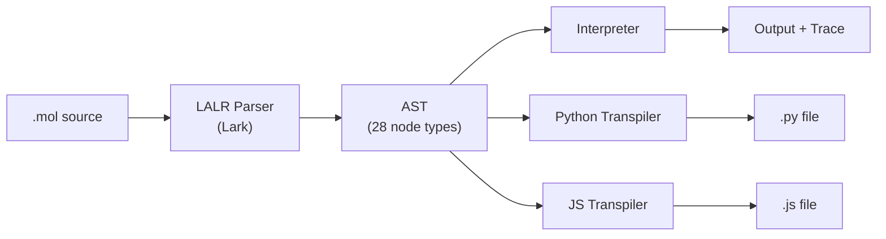

# Language Overview

MOL is a **statically-scoped, dynamically-typed** programming language built for cognitive computing and AI pipeline development.

## Design Principles

1. **Pipelines are first-class** — The `|>` operator is a core language feature, not a library
2. **Visibility by default** — Auto-tracing means you never fly blind
3. **Domain-aware types** — AI concepts are language primitives, not dicts
4. **Safety built-in** — Guards and access control at the language level
5. **Universal utility** — Algorithms and data structures everyone needs
6. **Write once, run anywhere** — Transpile to Python or JavaScript

## Architecture



## File Extension

All MOL source files use the `.mol` extension.

## Comments

```text
-- This is a comment (double dash)
-- MOL uses Lua/Haskell-style comments
```

## Program Structure

A MOL program is a sequence of statements executed top-to-bottom:

```text
-- 1. Declarations
let name be "MOL"
let version be 0.2

-- 2. Functions
fn greet(who)
  return "Hello, " + who
end

-- 3. Logic
if version > 0.1 then
  show greet(name)
end
```

## Keywords (30)

| Category | Keywords |
|----------|----------|
| Variables | `let`, `be`, `set`, `to` |
| Output | `show` |
| Control | `if`, `then`, `elif`, `else`, `end` |
| Loops | `while`, `for`, `in`, `do` |
| Functions | `fn`, `return`, `pipeline` |
| Logic | `and`, `or`, `not`, `is` |
| Literals | `true`, `false`, `null` |
| Domain | `trigger`, `link`, `process`, `access`, `sync`, `evolve`, `emit`, `listen`, `with` |
| Safety | `guard` |
| Blocks | `begin` |

## Operators

| Precedence | Operators | Description |
|:---:|---|---|
| 1 (lowest) | `\|>` | Pipe (left-to-right data flow) |
| 2 | `or` | Logical OR |
| 3 | `and` | Logical AND |
| 4 | `not` | Logical NOT |
| 5 | `==` `!=` `>` `<` `>=` `<=` `is` | Comparison |
| 6 | `+` `-` | Addition, Subtraction |
| 7 | `*` `/` `%` | Multiplication, Division, Modulo |
| 8 | `^` | Exponentiation |
| 9 (highest) | `-` (unary) | Negation |

## Type System

MOL is dynamically typed with 12 built-in types:

| Type | Example | Description |
|------|---------|-------------|
| `Number` | `42`, `3.14` | IEEE 754 float |
| `Text` | `"hello"` | UTF-8 string |
| `Bool` | `true`, `false` | Boolean |
| `null` | `null` | Null value |
| `List` | `[1, 2, 3]` | Ordered collection |
| `Map` | `{"key": "value"}` | Key-value store |
| `Thought` | `Thought("idea", 0.9)` | Idea with confidence |
| `Memory` | `Memory("key", value)` | Labeled storage |
| `Node` | `Node("label", 0.5)` | Neural node |
| `Stream` | `Stream("data")` | Event stream |
| `Document` | `Document("file", text)` | Source document |
| `Embedding` | `Embedding("text", "model")` | Vector embedding |

Optional type annotations:

```text
let x: Number be 42        -- passes
let y: Text be 42          -- MOLTypeError!
```
