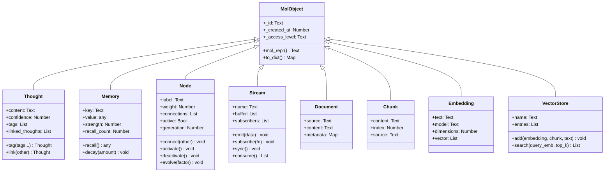

# Domain Types Reference

Detailed reference for all MOL domain types.

## Type Hierarchy



## MolObject (Base)

All domain types inherit from `MolObject`:

| Field | Type | Description |
|-------|------|-------------|
| `_id` | Text | Unique 8-char hex identifier |
| `_created_at` | Number | Unix timestamp |
| `_access_level` | Text | Security level (default: `"public"`) |

## Thought

**Constructor:** `Thought(content, confidence)`

| Field | Type | Default | Description |
|-------|------|---------|-------------|
| `content` | Text | required | The thought content |
| `confidence` | Number | required | Confidence score (0.0–1.0, clamped) |
| `tags` | List | `[]` | Tags |
| `linked_thoughts` | List | `[]` | Linked thoughts |

**Example:**
```text
let idea be Thought("MOL is the future", 0.95)
show idea.content       -- "MOL is the future"
show idea.confidence    -- 0.95
```

## Memory

**Constructor:** `Memory(key, value)`

| Field | Type | Default | Description |
|-------|------|---------|-------------|
| `key` | Text | required | Memory label |
| `value` | any | required | Stored value |
| `strength` | Number | `1.0` | Decays over time |
| `recall_count` | Number | `0` | Access count |

**Example:**
```text
let mem be Memory("session", "important data")
let val be recall(mem)    -- returns value, boosts strength
```

## Node

**Constructor:** `Node(label, weight)`

| Field | Type | Default | Description |
|-------|------|---------|-------------|
| `label` | Text | required | Node name |
| `weight` | Number | required | Connection weight |
| `connections` | List | `[]` | Connected nodes |
| `active` | Bool | `false` | Active state |
| `generation` | Number | `0` | Evolution count |

**Example:**
```text
let a be Node("input", 0.5)
let b be Node("hidden", 0.8)
link a to b       -- a.connections includes b
evolve a          -- weight *= 1.1, generation += 1
```

## Stream

**Constructor:** `Stream(name)`

| Field | Type | Default | Description |
|-------|------|---------|-------------|
| `name` | Text | required | Stream name |
| `buffer` | List | `[]` | Message buffer |
| `subscribers` | List | `[]` | Callback list |

## Document

**Constructor:** `Document(source, content)`

| Field | Type | Default | Description |
|-------|------|---------|-------------|
| `source` | Text | required | File name or URL |
| `content` | Text | required | Full text content |
| `metadata` | Map | `{}` | Optional metadata |

**Example:**
```text
let doc be Document("paper.txt", "Machine learning enables...")
show doc.source    -- "paper.txt"
show len(doc.content)  -- character count
```

## Chunk

**Constructor:** `Chunk(content, index, source)`

| Field | Type | Default | Description |
|-------|------|---------|-------------|
| `content` | Text | required | Chunk text |
| `index` | Number | required | Position in document |
| `source` | Text | `""` | Source document |

Created by `chunk()` function on Documents or text.

## Embedding

**Constructor:** `Embedding(text, model)`

| Field | Type | Default | Description |
|-------|------|---------|-------------|
| `text` | Text | required | Source text (truncated 80 chars) |
| `model` | Text | `"mol-sim-v1"` | Model name |
| `dimensions` | Number | `64` | Vector dimensions |
| `vector` | List | auto-generated | Float vector |

!!! info "Deterministic Vectors"
    MOL generates deterministic 64-dimensional pseudo-embeddings using SHA-256 hashing. Same text → same vector. Useful for testing and reproducible pipelines.

## VectorStore

Created by `store()` function.

| Field | Type | Default | Description |
|-------|------|---------|-------------|
| `name` | Text | required | Store identifier |
| `entries` | List | `[]` | Stored embeddings |

Search uses **cosine similarity** for ranking results.
